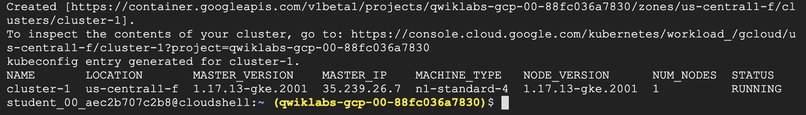

# Autoscaling TensorFlow Model Deployments with TF Serving and Kubernetes


## GSP777


![[/fragments/labmanuallogo]]


## Overview

Serving deep learning models can be especially challenging. The models are often large requiring gigabytes of memory. They are also 
very compute intensive - a small number of concurrent requests can fully utilize a CPU or GPU. Automatic horizontal scaling is one of the primary
strategies used in architecting scalable and reliable model serving infrastructures for deep learning models.

In this lab, you will use [TensorFlow Serving](https://www.tensorflow.org/tfx/guide/serving) and [Google Cloud Kubernetes Engine (GKE)](https://cloud.google.com/kubernetes-engine) to configure a high-performance, autoscalable serving system for TensorFlow models.

### Objectives

In this lab, you will learn how to:

* Configure a GKE cluster with an autoscaling node pool.
* Deploy TensorFlow Serving in an autoscalable configuration.  
* Monitor serving performance and resource utilization


### Prerequisites

To successfully complete the lab you need to have a solid understanding of how to save and load TensorFlow models and a basic familiarity with Kubernetes concepts and architecture. Before proceeding with the lab we recommend reviewing the following resources:

* [Using the SavedModel format](https://www.tensorflow.org/guide/saved_model)
* [Kubernetes Overview](https://kubernetes.io/docs/concepts/overview/)

### Lab scenario

You will use [TensorFlow Serving](https://www.tensorflow.org/tfx/serving/architecture) to deploy the **ResNet101** model. TensorFlow Serving is a flexible, high-performance serving system for machine learning models, designed for production environments. TensorFlow Serving makes it easy to deploy new algorithms and experiments, while keeping the same server architecture and APIs. TensorFlow Serving provides out-of-the-box integration with TensorFlow models, but can be easily extended to serve other types of models and data.

TensorFlow Serving can be run in a docker container and deployed and managed by Kubernetes. In the lab, you will deploy TensorFlow Serving as 
a [Kubernetes Deployment](https://kubernetes.io/docs/concepts/workloads/controllers/deployment/) on Google Cloud Kubernetes Engine (GKE)  and use [Kubernetes Horizontal Pod Autoscaler](https://kubernetes.io/docs/tasks/run-application/horizontal-pod-autoscale/) to automatically scale the number of TensorFlow Serving replicas based on observed CPU utilization. You will also use [GKE Cluster Autoscaler](https://cloud.google.com/kubernetes-engine/docs/concepts/cluster-autoscaler) to automatically resize your **GKE** cluster's node pool based on the resource demands generated 
by the TensorFlow Serving Deployment.

Horizontal Pod Autoscaler automatically scales the number of Pods in a replication controller, deployment, replica set or stateful set based on observed CPU utilization (or, with custom metrics support, on some other application-provided metrics). Horizontal Pod Autoscaler is implemented as a Kubernetes API resource and a controller. The resource determines the behavior of the controller. The controller periodically adjusts the number of replicas in a replication controller or deployment to match the observed average CPU utilization to the target specified by user.

GKE's Cluster Autoscaler automatically resizes the number of nodes in a given node pool, based on the demands of your workloads. You don't need to manually add or remove nodes or over-provision your node pools. Instead, you specify a minimum and maximum size for the node pool, and the rest is automatic.

After configuring the cluster and deploying TensorFlow Serving you will use an open source load testing tool [Locust](https://locust.io/) to generate
prediction requests against the **ResNet101** model and observe how the model deployment automatically scales up and down based on the load.

Summary of the tasks performed during the lab:
* Create a GKE cluster with autoscaling enabled on a default node pool
* Deploy the pretrained **ResNet101** model using TensorFlow Serving
* Configure Horizontal Pod Autoscaler
* Install **Locust** 
* Load the **ResNet101** model
* Monitor the model deployment

## Setup and requirements 

### __Qwiklabs setup__

![[/fragments/startqwiklab]]

![[/fragments/gcpconsole]]

![[/fragments/cloudshell]]

## Lab tasks

You will use **Cloud Shell** and **Cloud Console** for all of the tasks in the lab. Some tasks require you to edit text files. You can use any of the classic command line text 
editors pre-installed in **Cloud Shell**, including *vim*, *emacs*, or *nano*. You can also use the built-in [Cloud Shell Editor](https://cloud.google.com/shell/docs/launching-cloud-shell-editor).

Before proceeding, make sure that you completed the __Activate Cloud Shell__ step in the __Qwiklabs setup__ instructions and your **Cloud Shell** is open and ready.  

### Getting lab files

Start by getting the lab files from GitHub:

```
cd
SRC_REPO=https://github.com/GoogleCloudPlatform/mlops-on-gcp
kpt pkg get $SRC_REPO/workshops/mlep-qwiklabs/tfserving-gke-autoscaling@jk-qwiklabs tfserving-gke
cd tfserving-gke
```

### Creating a GKE cluster

Set the default compute zone and a couple of environment variables to store your project id and cluster name:

```
gcloud config set compute/zone us-central1-f

PROJECT_ID=$(gcloud config get-value project)
CLUSTER_NAME=cluster-1
```

To create a cluster execute the below command. It may take a few minutes to complete.

```
gcloud beta container clusters create $CLUSTER_NAME \
  --cluster-version=latest \
  --machine-type=n1-standard-4 \
  --enable-autoscaling \
  --min-nodes=1 \
  --max-nodes=3 \
  --num-nodes=1 
```

After the command completes you should see the ouput similar to one below:




The command created a CPU-based GKE cluster. The cluster has a default node pool, which is configured to autoscale from 1 to 3 nodes. Initially, the node pool has 
only one node.

Get the credentials for you new cluster so you can interact with it using `kubectl`.

```
gcloud container clusters get-credentials $CLUSTER_NAME 
```

### Deploying ResNet101 

The pretrained ResNet101 model in the `SavedModel` format has been uploaded to a public Google Cloud Storage location.

You will first download the model files to a storage bucket in your project. Since storage buckets are a global resource in Google Cloud you have to use a unique bucket name. For the purpose of this lab, you can use your project id as a name prefix.

To create a storage bucket in your project:

```
export MODEL_BUCKET=${PROJECT_ID}-bucket
gsutil mb gs://${MODEL_BUCKET}
```

After the bucket has been created copy the model files:

```
gsutil cp -r gs://jk-models/resnet_101 gs://${MODEL_BUCKET}
```

You are now ready to deploy TensorFlow Serving to GKE and configure it to serve the ResNet101 model.
You will deploy TF Serving in four steps:
1. First you will create a [Kubernetes ConfigMap](https://kubernetes.io/docs/concepts/configuration/configmap/) that points to the location of the ResNet101 model in your storage bucket
2. Then, you will create a [Kubernetes Deployment](https://kubernetes.io/docs/concepts/workloads/controllers/deployment/) using a [standard TensorFlow Serving image](https://hub.docker.com/r/tensorflow/serving) from **Docker Hub**.
3. When the deployment is ready, you will create a [Kubernetes Service](https://kubernetes.io/docs/concepts/services-networking/service/) to expose the deployment through a load balancer
4. Finally, you will configure Horizontal Pod Autoscaler

#### Creating ConfigMap

Use your preferred command line editor or **Cloud Shell Editor** to update the `MODEL_NAME` field in the `tf-serving/configmap.yaml` file to reference your bucket. Recall that the bucket name was stored in the $MODEL_BUCKET environment variable:

```
echo $MODEL_BUCKET
```

After the update the `configmap.yaml` should look similar to the one below:

```
apiVersion: v1
kind: ConfigMap
metadata:
  name: tfserving-configs
data:
  MODEL_NAME: image_classifier
  MODEL_PATH: gs://qwiklabs-gcp-03-4b91a600a7a2-bucket/resnet_101
```

Using `kubectl` create the *ConfigMap*:

```
kubectl apply -f tf-serving/configmap.yaml
```

#### Creating TensorFlow Serving deployment

Inspect the manifest for the TensorFlow Serving deployment.

```
cat tf-serving/deployment.yaml
```

Notice that the TF Serving process is configured to serve the model referenced by the `MODEL_PATH` environment variable and that this variable is set by the *ConfigMap* you created in the previous step.

```
...
    spec:
      containers:
      - name: tf-serving
        image: "tensorflow/serving"
        args: 
        - "--model_name=$(MODEL_NAME)"
        - "--model_base_path=$(MODEL_PATH)" 
        envFrom:
        - configMapRef:
            name: tfserving-configs
...
```

Also notice that the deployment is configured to start with one replica.

```
...
apiVersion: apps/v1
kind: Deployment
metadata:
  name: image-classifier
  namespace: default
  labels:
    app: image-classifier
spec:
  replicas: 1
...
```

In the deployment manifest, there is an explicit request for CPU and RAM resources:

```
...
resources:
  requests:
    cpu: "3"
    memory: 4Gi
...
```

At start, each replica requests 3 CPUs and 4 Gigabytes of RAM. Your cluster is configured with *n1-standard-4* nodes that have 4 virtual CPUs and 15GB or RAM. It means that only a single replica can run on a node.

Create the deployment.

```
kubectl apply -f tf-serving/deployment.yaml
```

It may take a few minutes before the deployment is ready. 

To check the status of the deployment:

```
kubectl get deployments
```

Wait till the *READY* column in the output of the previous command changes to `1/1`.


#### Exposing the deployment 

Inspect the manifest for the service:

```
cat tf-serving/service.yaml
```

Notice that the service is of type `LoadBalancer` and that it exposes two ports: 8500 and 8501. By default,  Tensorflow Serving uses port 8500 for the gRPC interface and port 8501 for the REST interface.

```
...
spec:
  type: LoadBalancer
  ports:
  - port: 8500
    protocol: TCP
    name: tf-serving-grpc
  - port: 8501
    protocol: TCP
    name: tf-serving-http
  selector:
    app: image-classifier
...
```

Create the service:

```
kubectl apply -f tf-serving/service.yaml
```

It may take a few minutes before the service is operational. Wait till the external IP address exposed by the service has been set. You can check the status of provisioning the service by executing the following command:

```
kubectl get svc image-classifier
```

When the service is ready you should see the output similar to the one below:


#### Configuring horizontal pod autoscaler

The final step is to add Horizontal Pod Autoscaler (HPA). The below command configures HPA to start a new replica of  TensorFlow Serving  whenever the mean CPU utilization across all already running replicas reaches 60%. HPA will attempt to create up to 4 replicas and and scale down to 1 replica. 

```
kubectl autoscale deployment image-classifier \
--cpu-percent=60 \
--min=1 \
--max=4 
```

To check the status of the HPA.

```
kubectl get hpa
```

#### Testing the model

The Tensorflow Serving model server is now up and running. You can test it by submitting a request using the `curl` command. In the `locust` folder you can find a sample request body (`request-body.json`) formatted to conform to the [TensorFlow Serving REST API](https://www.tensorflow.org/tfx/serving/api_rest). It contains the picture of [Grace Hopper](https://en.wikipedia.org/wiki/Grace_Hopper).


To invoke the model  set the `EXTERNAL_IP` environment variable to the external IP of your servce and execute the `curl` command:

```
EXTERNAL_IP=[YOUR_SERVICE_IP]
curl -d @locust/request-body.json -X POST http://${EXTERNAL_IP}:8501/v1/models/image_classifier:predict
```

The response returned by the model includes the list of 5 most likely labels with the associated probabilities. The response should look similar to the one below:


### Installing Locust

You are now ready to load test the ResNet101 model. As described previously, you will use an open source load testing tool [Locust](https://locust.io/) to generate prediction requests.

To install Locust:

```
pip3 install locust==1.4.1
```
The installation process can take a few minutes. The Locust command line interface (CLI) gets installed into the `~/.local/bin` folder which is not on *PATH*. You need to add this folder to *PATH*:

```
export PATH=~/.local/bin:$PATH
```

To validate the installation and show the Locust version number:

```
locust -V
```

### Starting a load test

The `locust` folder contains the Locust script that generates prediction requests against the ResNet101 model. The script uses the same request body you used previously to verify the TensorFlow Serving deployment. The script is configured to progressively increase the number of simulated users that send prediction requests to the ResNet101 model. After reaching the maximum number of configured users, the script stops generating the load. The number of users is adjusted every 60s.

Refer to [Locust documentation](https://docs.locust.io) for more information on Locust settings.

To start the test execute the below command. 

```
cd locust
locust -f tasks.py \
--headless \
--host http://${EXTERNAL_IP}:8501
```

### Monitoring the load test

You will monitor the behavior of the TensorFlow Serving deployment and the GKE node pool using [GKE Dashboards](https://cloud.google.com/kubernetes-engine/docs/concepts/dashboards).

To monitor the TensorFlow Serving deployment open a new tab in the same browser window in which you run Cloud Shell and navigate to the following URL:

```
https://console.cloud.google.com/kubernetes/deployment/us-central1-f/cluster-1/default/image-classifier/overview
```

You should see the page similar to one below:


Two lines on the *CPU line chart* in the upper left part of the page show the requested and the currently utilized CPUs. As the load increases, the number of requested CPUs will increase in steps of 3 as new replicas are started. The number of used CPUs will be a ragged curve representing the current utilization averaged across all allocated CPU resources.  The *CPU line chart* shows data delayed by about 60 seconds.

Note that you need to click on the *Refresh* button on the top menu to see the updates.

The *Managed pods* widget shows the currrent number of replicas. At the beginning of the test it will show one replica:


Soon you will see two pods. One running and one in the *unschedulable* state:


Recall that only one TensorFlow Serving pod can fit on a single cluster node. The pod stays in the *unschedulable state* while GKE autoscaler creates a new node. After both pods are in the running state you can verify that a new node has been created in the default node pool by opening the node pool dashboard in another browser tab.

```
https://console.cloud.google.com/kubernetes/nodepool/us-central1-f/cluster-1/default-pool
```


At some point the forth replica is scheduled:


The forth replica will not transition to the running state as the GKE autoscaler was configured to create a maximum of three nodes. 

After about 15 minutes, the script stops sending requests. As a result, the number of TensorFlow Serving replicas will also go down.

By default, the HPA will wait for 5 minutes before triggering the downscaling operation so you will need to wait at least 5 minutes to observe this behavior.

As the number of replicas goes down, the GKE autoscaler starts removing nodes from the default node pool.

For the purposes of scaling down, the autoscaler calculates the group's recommended target size based on peak load over the last 10 minutes. These last 10 minutes are referred to as the **stabilization period**. So be patient. It will take over 15 minutes after the script stopped generating predictions to see the changes in the size of the default node pool.

### Stopping the load test

To stop the load test kill the Locust process by issuing the *Ctrl+C* command in the Cloud Shell terminal.


## Next steps / learn more


![[/fragments/TrainingCertificationOverview]]

##### Manual Last Updated September 07, 2020

##### Lab Last Tested September 07, 2020

![[/fragments/copyright]]
